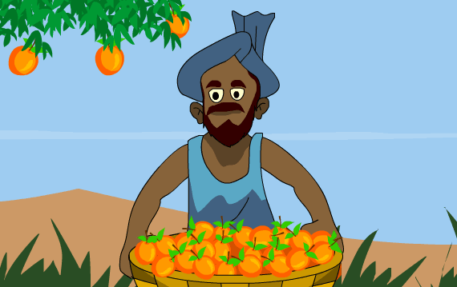

# 🌾 SoilSavant: Smart Recommendation System for Farming

  

## 🌱 Overview

**SoilSavant** is a machine learning-powered intelligent recommendation system built to assist farmers in selecting the **optimal crops and fertilizers** based on **soil health, environmental parameters, and seasonal weather trends**. It aims to revolutionize farming by enhancing yield, reducing waste, and promoting sustainable agricultural practices.

---

## 🧩 Problem Statement

### 🚜 Agricultural Challenges:
- Farmers struggle to choose the right crops/fertilizers due to variability in:
  - Soil nutrients
  - Temperature & humidity
  - Rainfall & seasonal patterns
- Lack of real-time, accurate recommendations reduces productivity and leads to resource misuse.

### 🌍 Sustainability Concerns:
- Excessive fertilizer use causes **soil degradation** and **environmental pollution**.
- Poor crop selection leads to **inefficient resource use** and **lower yields**.

---

## 🎯 Objectives

- 🔍 **Enhanced Decision Making:** Provide real-time data-driven insights for informed crop & fertilizer choices.
- 🌾 **Improved Crop Yield:** Use ML models to suggest the best crop for the local conditions.
- 📍 **Precision Agriculture:** Combine **N-P-K soil analysis**, **weather**, and **seasonal data** for precise recommendations.
- 🧠 **Farmer Empowerment:** Present data in a simple, user-friendly way for timely decisions.

---

## 💡 Proposed Solution

### 1️⃣ Crop Recommendation:
- Recommends crops based on:
  - **Soil nutrients**: Nitrogen (N), Phosphorus (P), Potassium (K)
  - **Temperature**
  - **Humidity**
  - **Rainfall**

### 2️⃣ Seasonal Crop Selection:
- 📌 **Summer Crops**: Suited for high temp & low humidity.
- ❄️ **Winter Crops**: Thrive in cool weather, need moderate water.
- 🌧️ **Rainy Crops**: Perfect for high rainfall & humidity.

### 3️⃣ Fertilizer Recommendation:
- Suggests optimal fertilizers by:
  - Matching nutrient deficiencies with crop requirements.
  - Promoting **sustainable fertilizer use** and **long-term soil health**.

---

## ✅ Expected Outcomes

| Feature                  | Description                                                                 |
|--------------------------|-----------------------------------------------------------------------------|
| 🌱 **Crop Recommendation**   | Suggests the best crops for your local soil and climate.                      |
| 🌿 **Fertilizer Guidance**   | Recommends fertilizers based on soil tests and weather inputs.                 |
| 🌦️ **Seasonal Adaptation**  | Helps in rotating crops based on seasonal changes.                             |
| 📊 **User-Friendly Output**  | Easy-to-understand UI for farmers, in local languages (future enhancement). |

---

## 👨‍👩‍👧‍👦 Project Team

✨ **Idea Proposed by - SUBGROUP 4 of GAUSS Group:**

- 👨 Pooran Singh  
- 👩 Anamika Kumari  
- 👨 Hirak Nath  
- 👨 Gaurav Tiwari  
- 👨 Prem Kumar

---

## 📌 Tech Stack

- 🧠 **Machine Learning** – Scikit-learn / TensorFlow for predictive modeling  
- 🌍 **Geospatial & Weather APIs** – For real-time weather data  
- 🧪 **Soil Analysis Dataset** – N, P, K levels and other micronutrients  
- 💻 **Frontend** – HTML / CSS / JavaScript (or Streamlit for rapid UI)  
- 🔙 **Backend** – Flask / FastAPI  
- 🧾 **Data** – Open Government Datasets & Agricultural Research Datasets  

## 🖼️ Screenshot Preview

> *(Add screenshots of the application)*

---

## 📎 License

This project is developed for educational and research purposes. For open-source use and contributions, feel free to fork and collaborate!

---
